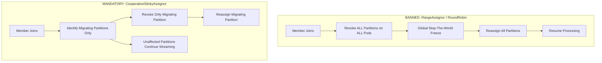
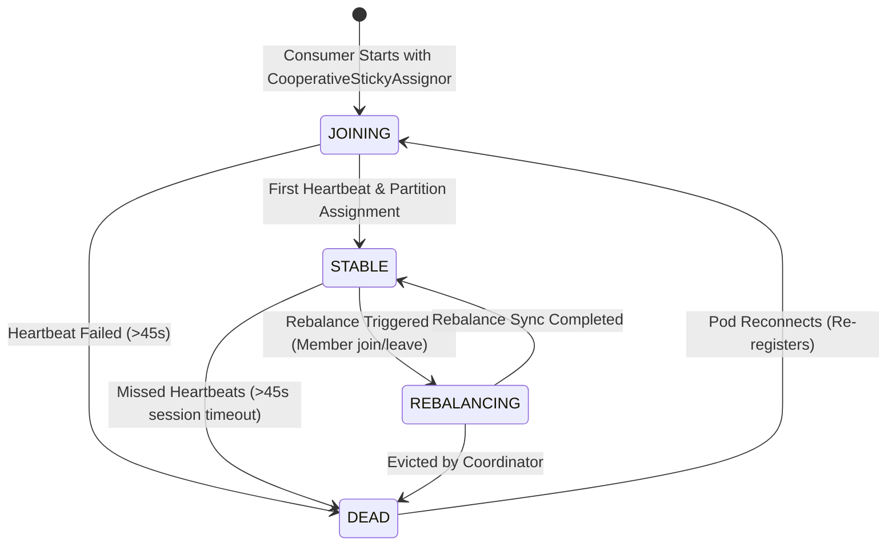

# Consumer Groups — Architecture Diagrams & Protocols

## 1. Cooperative Sticky vs Eager Rebalance Comparison

```mermaid
flowchart TD
    subgraph Eager Rebalance [BANNED: RangeAssignor / RoundRobin]
        E1[Member Joins] --> E2[Revoke ALL Partitions on ALL Pods]
        E2 --> E3[Global Stop-The-World Freeze]
        E3 --> E4[Reassign All Partitions]
        E4 --> E5[Resume Processing]
    end

    subgraph Cooperative Rebalance [MANDATORY: CooperativeStickyAssignor]
        C1[Member Joins] --> C2[Identify Migrating Partitions Only]
        C2 --> C3[Revoke Only Migrating Partition]
        C2 --> C4[Unaffected Partitions Continue Streaming]
        C3 --> C5[Reassign Migrating Partition]
    end
```

---

## 2. Member Lifecycle State Machine

```mermaid
stateDiagram-v2
    [*] --> JOINING: Consumer Starts with CooperativeStickyAssignor

    JOINING --> STABLE: First Heartbeat & Partition Assignment
    JOINING --> DEAD: Heartbeat Failed (>45s)

    STABLE --> REBALANCING: Rebalance Triggered (Member join/leave)
    STABLE --> DEAD: Missed Heartbeats (>45s session timeout)

    REBALANCING --> STABLE: Rebalance Sync Completed
    REBALANCING --> DEAD: Evicted by Coordinator

    DEAD --> JOINING: Pod Reconnects (Re-registers)
```

