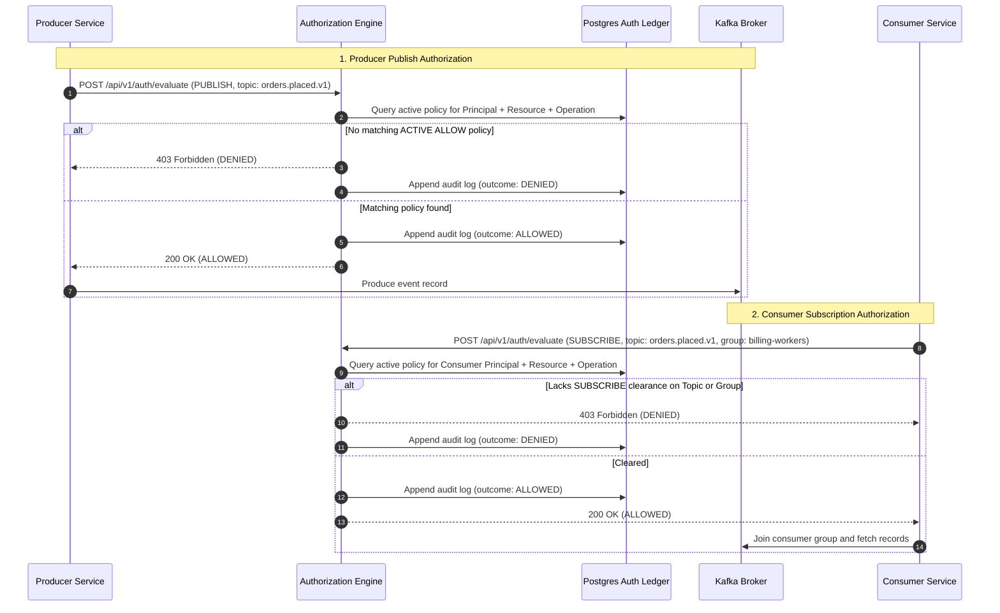

# Event Authorization Architecture & Sequence Diagrams

## Sequence Diagram: Produce & Consume Authorization Evaluation

```mermaid
sequenceDiagram
    autonumber
    participant Producer as Producer Service
    participant Gateway as Authorization Engine
    participant DB as Postgres Auth Ledger
    participant Kafka as Kafka Broker
    participant Consumer as Consumer Service

    Note over Producer,Kafka: 1. Producer Publish Authorization
    Producer->>Gateway: POST /api/v1/auth/evaluate (PUBLISH, topic: orders.placed.v1)
    Gateway->>DB: Query active policy for Principal + Resource + Operation
    alt No matching ACTIVE ALLOW policy
        Gateway-->>Producer: 403 Forbidden (DENIED)
        Gateway->>DB: Append audit log (outcome: DENIED)
    else Matching policy found
        Gateway->>DB: Append audit log (outcome: ALLOWED)
        Gateway-->>Producer: 200 OK (ALLOWED)
        Producer->>Kafka: Produce event record
    end

    Note over Consumer,Kafka: 2. Consumer Subscription Authorization
    Consumer->>Gateway: POST /api/v1/auth/evaluate (SUBSCRIBE, topic: orders.placed.v1, group: billing-workers)
    Gateway->>DB: Query active policy for Consumer Principal + Resource + Operation
    alt Lacks SUBSCRIBE clearance on Topic or Group
        Gateway-->>Consumer: 403 Forbidden (DENIED)
        Gateway->>DB: Append audit log (outcome: DENIED)
    else Cleared
        Gateway->>DB: Append audit log (outcome: ALLOWED)
        Gateway-->>Consumer: 200 OK (ALLOWED)
        Consumer->>Kafka: Join consumer group and fetch records
    end
```
