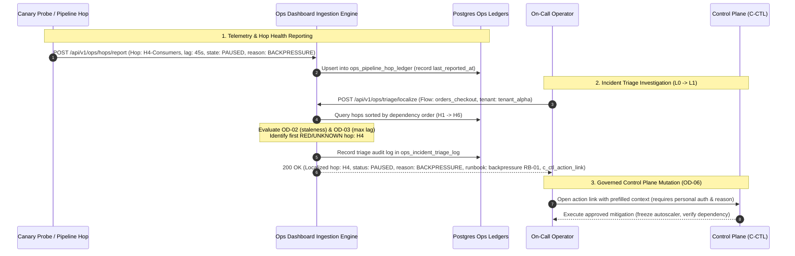

# Event Operations Dashboard Architecture & Sequence Diagrams

## Sequence Diagram: Incident Detection, L1 Hop Localization, and C-CTL Control Action

```mermaid
sequenceDiagram
    autonumber
    participant Canary as Canary Probe / Pipeline Hop
    participant Ingest as Ops Dashboard Ingestion Engine
    participant DB as Postgres Ops Ledgers
    participant Operator as On-Call Operator
    participant CCTL as Control Plane (C-CTL)

    Note over Canary,DB: 1. Telemetry & Hop Health Reporting
    Canary->>Ingest: POST /api/v1/ops/hops/report (Hop: H4-Consumers, lag: 45s, state: PAUSED, reason: BACKPRESSURE)
    Ingest->>DB: Upsert into ops_pipeline_hop_ledger (record last_reported_at)

    Note over Operator,CCTL: 2. Incident Triage Investigation (L0 -> L1)
    Operator->>Ingest: POST /api/v1/ops/triage/localize (Flow: orders_checkout, tenant: tenant_alpha)
    Ingest->>DB: Query hops sorted by dependency order (H1 -> H6)
    Note over Ingest: Evaluate OD-02 (staleness) & OD-03 (max lag)<br/>Identify first RED/UNKNOWN hop: H4
    Ingest->>DB: Record triage audit log in ops_incident_triage_log
    Ingest-->>Operator: 200 OK (Localized hop: H4, status: PAUSED, reason: BACKPRESSURE, runbook: backpressure RB-01, c_ctl_action_link)

    Note over Operator,CCTL: 3. Governed Control Plane Mutation (OD-06)
    Operator->>CCTL: Open action link with prefilled context (requires personal auth & reason)
    CCTL-->>Operator: Execute approved mitigation (freeze autoscaler, verify dependency)
```
