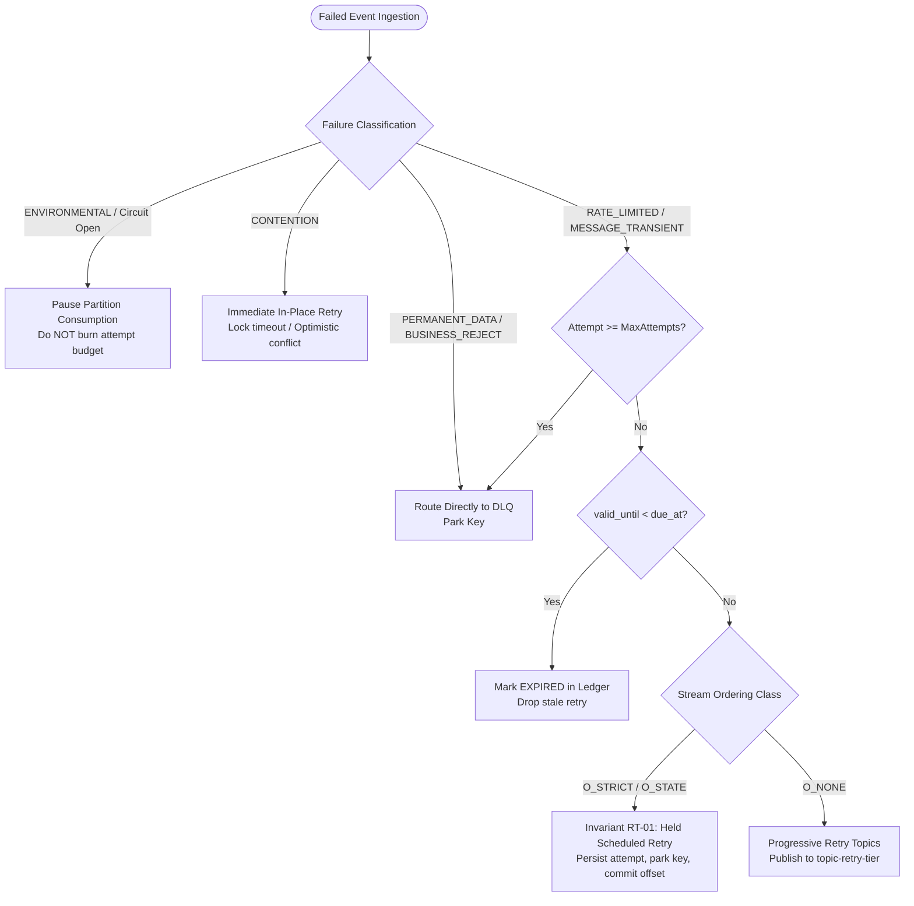
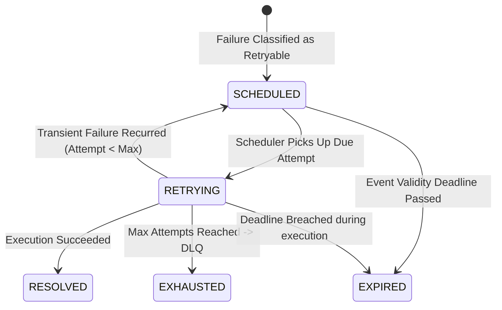

# Retry Topics — Architecture Diagrams & Workflows

## 1. Retry Strategy Selection Workflow

```mermaid
flowchart TD
    Start([Failed Event Ingestion]) --> Classify{Failure Classification}

    Classify -->|ENVIRONMENTAL / Circuit Open| Pause[Pause Partition Consumption\nDo NOT burn attempt budget]
    Classify -->|CONTENTION| InPlace[Immediate In-Place Retry\nLock timeout / Optimistic conflict]
    Classify -->|PERMANENT_DATA / BUSINESS_REJECT| DLQ[Route Directly to DLQ\nPark Key]
    
    Classify -->|RATE_LIMITED / MESSAGE_TRANSIENT| CheckAttempts{Attempt >= MaxAttempts?}
    CheckAttempts -->|Yes| DLQ
    CheckAttempts -->|No| CheckDeadline{valid_until < due_at?}
    
    CheckDeadline -->|Yes| Expired[Mark EXPIRED in Ledger\nDrop stale retry]
    CheckDeadline -->|No| CheckOrdering{Stream Ordering Class}

    CheckOrdering -->|O_STRICT / O_STATE| HeldRetry[Invariant RT-01: Held Scheduled Retry\nPersist attempt, park key, commit offset]
    CheckOrdering -->|O_NONE| TopicRetry[Progressive Retry Topics\nPublish to topic-retry-tier]
```

---

## 2. Retry Attempt State Machine

```mermaid
stateDiagram-v2
    [*] --> SCHEDULED: Failure Classified as Retryable

    SCHEDULED --> RETRYING: Scheduler Picks Up Due Attempt
    SCHEDULED --> EXPIRED: Event Validity Deadline Passed

    RETRYING --> RESOLVED: Execution Succeeded
    RETRYING --> SCHEDULED: Transient Failure Recurred (Attempt < Max)
    RETRYING --> EXHAUSTED: Max Attempts Reached -> DLQ
    RETRYING --> EXPIRED: Deadline Breached during execution
```

